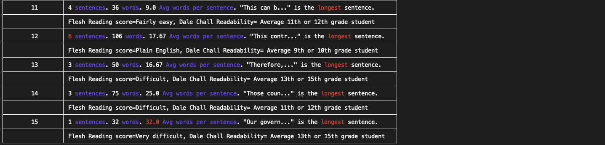

# Homer

Homer is a Python package for analysing text.

This grew out of a personal need. I am not a native English speaker but interested in writing so I have been using this to improve my writing. Home gives basic insights about writing. I hope others might find it useful.

This tool is not a strict guide to control your writing. At least, I don't use it that way. I use to guide my writing to make it brief and simpler for the reader whenever possible.

Generally it provides information on paragraphs and sentences so you can sense if writing is getting a bit complex. For example, longer sentences and paragraphs do not make a light reading. Also, it gives a general sense of readability by computing readability scores of the text (using Flesch reading ease and Dale Chall readability scores).

Moreover, it gives insights whether the text is using zombie nouns, abstract nouns, compulsive hedgers, intensifiers, abstract nouns and too many "and" words in the text. All of this make text less readable. More information on all of these in the `Acknowledgements` section.

You can use it as a standalone package or on command line. If you run it on the command line you can get general
stats on your essay as well as paragraph stats as shown below.

#####  Article / Essay Stats

It gives your some basic insights about your overall text. If you run it from the command line you will see the following information for the overall text.

* Reading time (in mins)
* Readability scores (Flesch reading ease and Dale Chall readability scores)
* Total paragraphs, sentences and words
* Average sentences per paragraph
* Average words per sentence
* "and" frequency
* Number of zombie nouns, compulsive hedgers, intensifiers, abstract nouns, vague words
* In the end it lists down the zombie nouns, compulsive hedgers, intensifiers, abstract nouns, and vague words that it finds in the text


##### Paragraph Stats

Pargraph stats point out the following information for _each paragraph_.

* Number of sentences, and words
* Average words per sentence
* longest sentence
* Readability scores (Flesch reading ease and Dale Chall readability scores)
* If number of sentences go beyond 5 in a paragraph then it's highlighted in red.
* Similarly, when number of words go beyond 25 in a sentence then that is also highlighted in red.


Some more paragraph stats.



## Installation

Use the requirements.txt to install the package.

```bash
pip install -r requirements.txt
```

## Usage

```python
from homer import Article

article = Article('Article name', 'Author', open('/file/path/article.txt').read())
article.print_article_stats()
article.print_paragraph_stats()
```

## Tests

Tests can be run from the `tests` directory.

## Authors

* Waqas Younas (waqas.younas@gmail.com)


## Acknowledgements

* Steven Pinker's [The Sense of Style: The Thinking Person's Guide to Writing in the 21st Century](https://www.amazon.com/Sense-Style-Thinking-Persons-Writing/dp/0143127799). This gave me quite a few insights. It also prompted me to include tracking of zombie nouns, abstract nouns, complex hedgers and Intensifiers.
  - Zombie nouns: https://www.youtube.com/watch?v=dNlkHtMgcPQ

  - Abstract nouns: Words such as _approach, assumption, concept, context, framework, process, model, role, strategy, perspective, variable, etc._

  - Complex hedgers: These are words such as _apparently, almost, fairly, nearly, partially, predominantly, presumably, rather, relative, seemingly, etc._

  - Intensifiers: Words such as a _very, highly, extremely_.


* Bankspeak:
The Language
of World Bank Reports,
1946–2012: https://litlab.stanford.edu/LiteraryLabPamphlet9.pdf. This gave me few ideas. The idea to keep track of "and" words and the vague words in a text is taken from here.

    -  "and" frequency: Basically it is the number of times the word "and" is used in the text (given as percentage of total text). I try to keep under 3 %.

    - Vague words is list of words I compiled after reading the above report. Unnecessairly using these words can make the text more abstract. These are words such as _derivative, fair value, portfolio, evaluation, competitiveness, reform, growth, capacity, progress, stability, protection, access, sustainable, etc._

## Contributing
Pull requests are welcome. For major changes, please open an issue first to discuss what you would like to change.

Please make sure to update tests as appropriate.

## License
[MIT](https://choosealicense.com/licenses/mit/)
