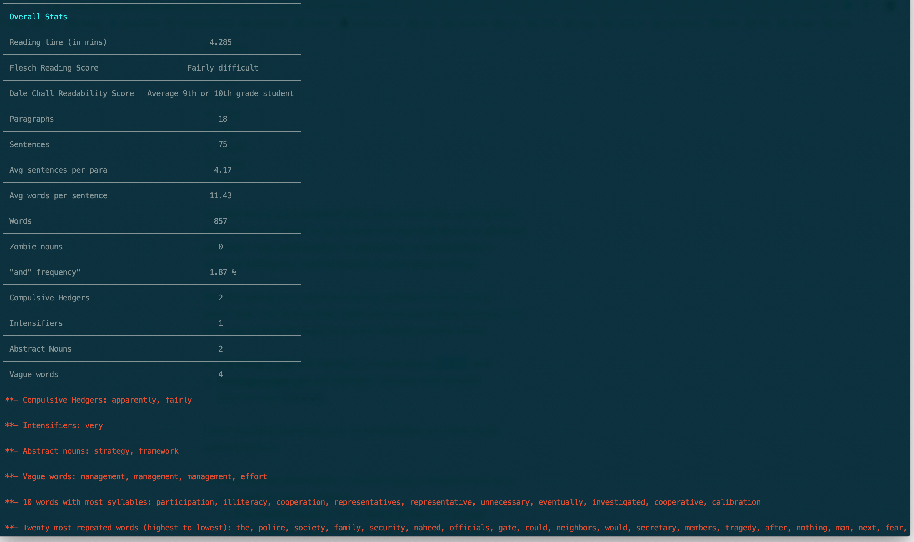
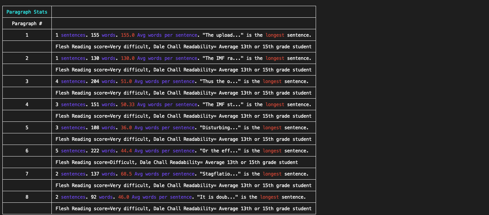

# Homer

Homer is a Python package that can help make your text more clear, simple and useful for the reader.

It provides information on an overall text as well as on individual paragraphs. It gives insights into readability, length of paragraphs, length of sentences, average sentences per paragraph, average words in a sentence, etc. Further, it tries to identify words that make the text less readable, for example, zombie nouns, abstract nouns, compulsive hedgers, and intensifiers. It also tracks the frequency of "and" words in the text. (More information on all of these follows in the `Acknowledgements` section.)

This software package grew out of a personal need. Since I am not a native English speaker but am interested in writing, I designed and have been using Homer to improve my writing. I hope others will find it useful.

Please note that this is not a strict guide to control your writing. At least, I don't use it that way. I use it as a guide to make my writing as simple as possible. I strive to write concise paragraphs and sentences as well as use fewer unclear words, and Homer has been helping me. I have only used it to analyze my blogs and essays and not the large corpus of text. As this software is new, you may well spot bugs, in which case please feel free to open up issues/pull-requests.

You can use Homer as a stand-alone package or on the command line. If you run it on the command line, you can get general stats on your article or essay as well as paragraph stats.

#####  Article/Essay Stats

Running Homer from the command line gives the following insights about the overall text:

* Reading time in minutes (although this will vary some from reader to reader)
* Readability scores (Flesch reading ease and Dale Chall readability scores)
* Total paragraphs, sentences, and words
* Average sentences per paragraph
* Average words per sentence
* "and" frequency
* Number of zombie nouns, compulsive hedgers, intensifiers, abstract nouns, vague words
* At the end, it goes on to list the zombie nouns, compulsive hedgers, intensifiers, abstract nouns, and vague words that it found.




##### Paragraph Stats

Paragraph stats point out the following information for _each paragraph_:

* Number of sentences and words
* Average words per sentence
* The longest sentence in the paragraph
* Readability scores (Flesch reading ease and Dale Chall readability scores)
* If the number of sentences is more than five in a paragraph, then Homer gives a warning highlighted in red.
* Similarly, when the number of words is more than 25 in a sentence, then a warning highlighted in red is given.




## Installation

I built this on Python 3.4.5. First create a virtual environment.

 ```bash
python3 -m venv /path/to/env
source /path/to/env/bin activate
```

Use the requirements.txt to install the required packages.

```bash
pip install -r requirements.txt
```

After installing required Python libraries you may need to also install these nltk resources:
- _punkt_,  _average_perceptron_tagger_, _cmudict_ and _stopwords_

These can download by running the following code from the command line, after activating the virtual environment
```Python
>>> import nltk
>>> nltk.download('punkt')
# after punkt is install, let's install other packages one by one
>>> nltk.download('averaged_perceptron_tagger')
>>>nltk.download('cmudict')
>>> nltk.download('stopwords')
```
## Usage

```python
from homer.analyzer import Article

article = Article('Article name', 'Author', open('/file/path/article.txt').read())
article.print_article_stats()
article.print_paragraph_stats()
```

## Tests

Tests can be run from the `tests` directory.

## Authors

* [Waqas Younas](http://blog.wyounas.com) (waqas.younas@gmail.com)


## Acknowledgements

* Steven Pinker's [The Sense of Style: The Thinking Person's Guide to Writing in the 21st Century](https://www.amazon.com/Sense-Style-Thinking-Persons-Writing/dp/0143127799). This book gave me quite a few insights. It also prompted me to include tracking of zombie nouns, abstract nouns, complex hedgers and intensifiers.

  - Zombie nouns: https://www.youtube.com/watch?v=dNlkHtMgcPQ

  - Abstract nouns: Words such as _approach, assumption, concept, context, framework, process, model, role, strategy, perspective, variable, etc._

  - Complex hedgers: These are words such as _apparently, almost, fairly, nearly, partially, predominantly, presumably, rather, relative, seemingly, etc._

  - Intensifiers: Words such as _very, highly, extremely_.

* Bankspeak:
The Language
of World Bank Reports,
1946–2012: https://litlab.stanford.edu/LiteraryLabPamphlet9.pdf. This source also gave me a few ideas. The idea to keep track of "and" and the vague words in a text was taken from here.

    -  "and" frequency: Basically it is the number of times the word "and" is used in the text (given as a percentage of total text). I try to keep it under 3 %.

    - Vague words is a list of words I compiled after reading the above report.  Using these words unnecessarily, or without giving them the proper context, can make a text more abstract. These are words such as _derivative, fair value, portfolio, evaluation, strategy, competitiveness, reform, growth, capacity, progress, stability, protection, access, sustainable, etc._


## Contributing
Pull requests are welcome. For major changes, please open an issue first to discuss what you would like to change.

Please make sure to update tests as appropriate.

## License
[MIT](https://choosealicense.com/licenses/mit/)
